# P2-01 — Integrated System Architecture

## 1. Architecture Decision

The Project 7 artifact will use a **configuration-first, evidence-grounded, human-authority architecture** for small public-sector consulting businesses. ICM Solutions is the primary reference implementation, while a fictional organization profile demonstrates portability without source-code changes or model retraining.

The system integrates four prior runtime contributors:

- **Projects 1 and 2:** opportunity ingestion, normalization, provenance, service alignment, historical procurement context, and staffing-family context;
- **Project 4:** bounded clause-theme triage using a validated CPU inference package;
- **Project 6:** deterministic evidence tools, state governance, safeguards, reason codes, audit logging, escalation, and human review.

Projects 3 and 5 remain bounded design and responsible-AI evidence.

## 2. System Boundary

The framework may:

- ingest and normalize approved opportunity records;
- load organization-specific services, rules, roles, and thresholds;
- assess service alignment and historical context;
- classify selected contract or solicitation passages into bounded themes;
- retrieve and validate approved official evidence;
- identify supporting evidence, counterevidence, conditions, and missing information;
- generate a **nonbinding** recommendation and recommended next actions;
- route the packet to an authorized human reviewer;
- record the original recommendation and final human disposition.

The framework may not:

- make or communicate a final bid/no-bid decision;
- provide legal advice or make an authoritative legal or regulatory determination;
- approve compliance, risk, security, privacy, price, staffing, or contract terms;
- submit a proposal or perform any autonomous external write action;
- conceal uncertainty, missing information, counterevidence, or human overrides;
- claim production readiness.

## 3. Architectural Layers

### 3.1 Case Intake and Human Interface

The system begins with an approved public, frozen, synthetic, de-identified, or explicitly authorized opportunity record. Intake creates a case ID, validates required fields, preserves original values, records provenance and checksums, and recommends whether the record is ready for analysis.

The human interface supports:

- opportunity submission and correction;
- specialist review requests;
- recommendation review;
- acceptance, modification, rejection, deferral, or escalation;
- final rationale and case status.

### 3.2 Configuration and Fixed Governance

Organization-specific business knowledge is externalized in JSON and CSV artifacts:

- organization profile;
- service catalog;
- opportunity rules;
- staffing map;
- reviewer roles;
- recommendation thresholds.

The shared schema and referential-integrity validator reject incomplete or inconsistent profiles. The framework-level safeguard policy remains non-overridable.

### 3.3 Structured Opportunity Analysis

The structured-data layer adapts the strongest patterns from Projects 1 and 2:

1. source-specific parsing behind a common interface;
2. field validation and normalization;
3. preservation of original values;
4. deterministic record keys;
5. exclusion-first capability screening;
6. explicit matched and excluded terms;
7. descriptive historical context;
8. staffing-family context without named-person commitments.

Historical counts are contextual evidence only. They are not forecasts, award probabilities, staffing capacity estimates, or eligibility determinations.

### 3.4 Contract and Evidence Analysis

Selected solicitation or contract passages enter two bounded paths:

- **Clause-theme triage:** Project 4 CPU inference produces a theme, confidence, model version, and domain-shift warning. Low-confidence or out-of-domain inputs abstain or escalate.
- **Official evidence review:** Project 6 patterns support exact clause retrieval, semantic search, citation and metadata validation, evidence-sufficiency assessment, and conflict detection.

The newly acquired FAR source candidate retains the expected FAC 2026-01 and March 13, 2026 effective date but differs at the byte level from the prior checksum. The architecture therefore requires deterministic normalization, new versioning, new checksums, and representative clause validation before authoritative evaluation.

### 3.5 Assessment and Recommendation

The recommendation engine combines validated outputs rather than relying on an unsupported language-model judgment. Every advisory recommendation contains:

- recommendation label and code;
- visible nonbinding disclosure;
- recommendation strength or confidence;
- supporting evidence;
- counterevidence;
- missing information;
- unresolved questions;
- conditions;
- known limitations;
- required human reviewer;
- recommended next action;
- data freshness;
- reason codes;
- audit reference.

Permitted advisory outcomes are:

- Recommend Pursue;
- Recommend Pursue with Conditions;
- Recommend Hold — Gather Information;
- Recommend Do Not Pursue;
- Escalate — Specialized Review Required;
- No Recommendation.

### 3.6 Human Decision

The human role is substantive. An authorized reviewer may:

- accept;
- accept with modified conditions;
- reject;
- defer pending information;
- escalate.

The original system recommendation remains immutable in the audit trail. The final human disposition, modifications, rationale, role, and timestamp are stored separately.

### 3.7 State, Audit, and Evaluation

Every case is traceable through:

- source identifiers and checksums;
- organization profile and configuration versions;
- rule and reason-code versions;
- model and tokenizer versions;
- official corpus version;
- tool calls and validation results;
- recommendation inputs and outputs;
- human modifications and disposition;
- environment and run manifests.

An audit-write failure stops processing. The framework does not continue to a recommendation when required traceability cannot be persisted.

## 4. Primary End-to-End Flow

1. Create case and validate source provenance.
2. Load and validate the active organization profile.
3. Normalize the opportunity record and assign a deterministic case key.
4. Screen configured services using exclusion-first rules.
5. Attach descriptive historical and staffing-family context.
6. Select relevant solicitation or contract passages.
7. Run bounded clause-theme triage.
8. Retrieve exact or semantically relevant approved evidence.
9. Validate citations, metadata, sufficiency, conflicts, freshness, and limits.
10. Assemble supporting evidence, counterevidence, gaps, conditions, and reviewer routing.
11. Produce a nonbinding recommendation or abstain/escalate.
12. Run packet-completeness validation.
13. Route the packet to the authorized human reviewer.
14. Record the final human disposition and rationale.
15. Preserve audit and evaluation artifacts.

## 5. Failure and Escalation Rules

| Condition | Required Behavior |
|---|---|
| Invalid or incomplete profile | Reject configuration and fail closed |
| Attempted safeguard override | Reject profile and record reason code |
| Missing or unverified source provenance | Quarantine record and require review |
| Confidential, personal, credential, or restricted data | Block, redact, or route to privacy/security review |
| Project 4 package missing or incompatible | Disable runtime triage and route to manual review |
| Low-confidence or out-of-domain passage | Abstain from classification and route to specialist |
| Invalid or missing official citation | No authoritative claim; retrieve more evidence or escalate |
| Contradictory evidence | Display conflict and require specialist review |
| Stale material data | Hold, refresh, or mark limitation |
| Tool or API failure | Use deterministic fallback where permitted; otherwise fail closed |
| Audit persistence failure | Stop the workflow |
| Request for autonomous external action | Deny and route to authorized human |
| Insufficient evidence for recommendation | No Recommendation or Escalate |

## 6. Deployment Topology

The capstone baseline uses:

- Google Colab CPU for execution;
- GitHub as the authoritative repository;
- local JSON, CSV, model, corpus, output, and audit artifacts;
- optional securely configured model-provider credentials only when the integrated agent is activated;
- no external write connectors.

A production deployment would require formal security, privacy, legal, operational, records-management, model-governance, and change-control approval.

## 7. Architecture Decision Records

| ADR | Decision | Rationale |
|---|---|---|
| ADR-01 | Configuration-first organization portability | Supports other small businesses without retraining or source-code changes |
| ADR-02 | Modular pipeline plus bounded agentic evidence workflow | Keeps deterministic functions testable while preserving agentic orchestration where useful |
| ADR-03 | Recommendation separated from final human decision | Prevents advisory output from becoming implicit autonomous authority |
| ADR-04 | Exact evidence retrieval precedes semantic retrieval when a citation is supplied | Reduces fabricated or mismatched authority |
| ADR-05 | Project 4 used only for bounded triage | CUAD domain shift and high-confidence errors prohibit legal interpretation |
| ADR-06 | Append-only case audit and provenance | Supports reproducibility, accountability, and evaluation |
| ADR-07 | No autonomous external write action | Preserves human control and limits operational harm |
| ADR-08 | CPU-first baseline | Avoids unnecessary deep-learning cost after checkpoint export |
| ADR-09 | Fail closed on invalid configuration, insufficient evidence, or audit failure | Prevents unsupported conclusions and untraceable actions |
| ADR-10 | New FAR candidate is versioned rather than misrepresented as recovered | Preserves source integrity and intellectual honesty |

## 8. Diagrams

### 8.1 System Context

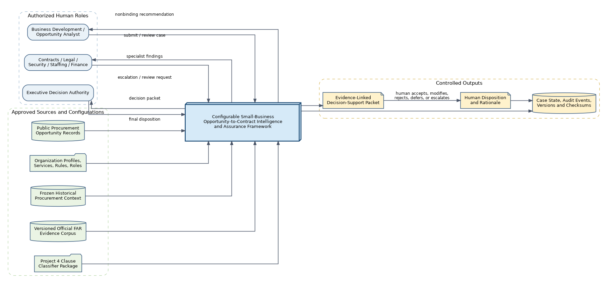

### 8.2 Integrated Components

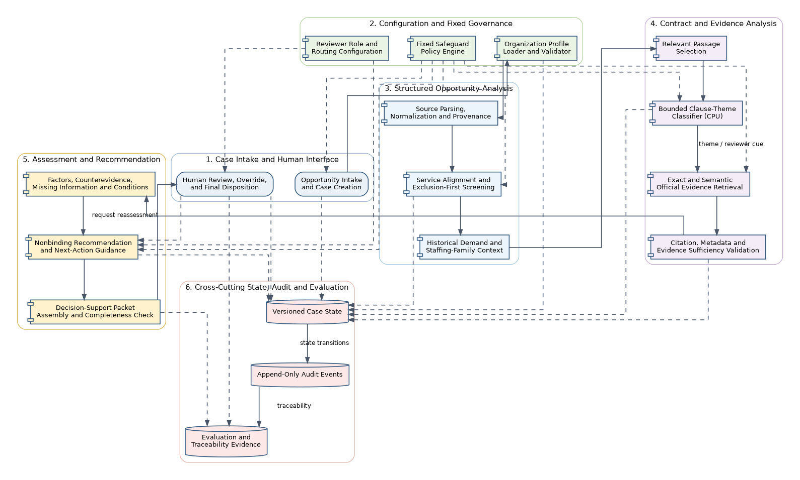

### 8.3 Configuration Portability

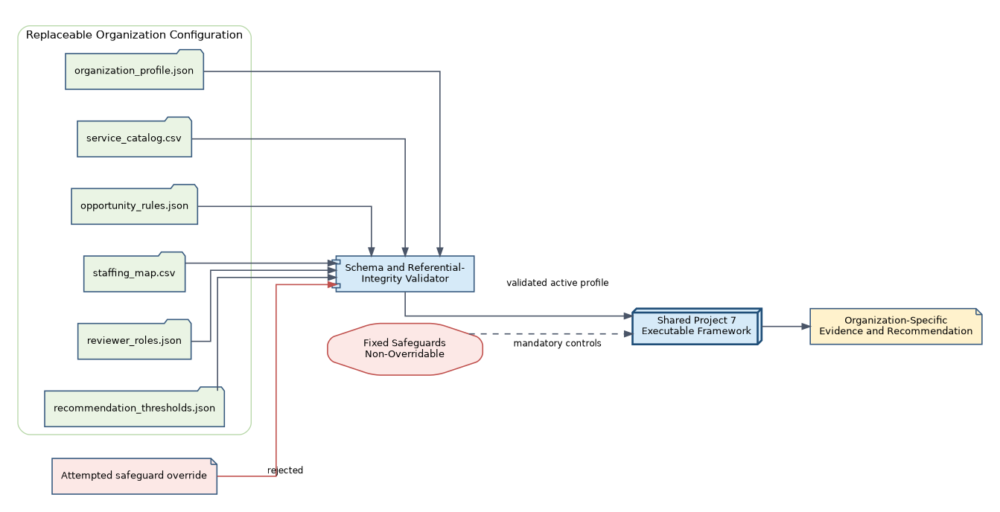

### 8.4 Recommendation and Human Decision

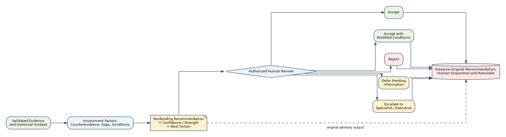

### 8.5 Failure and Escalation

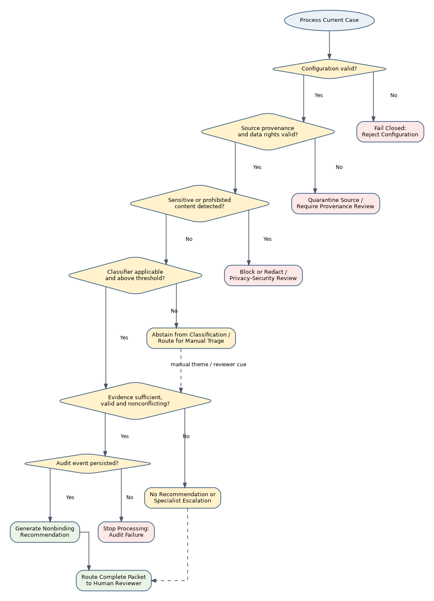

### 8.6 Provenance and Audit

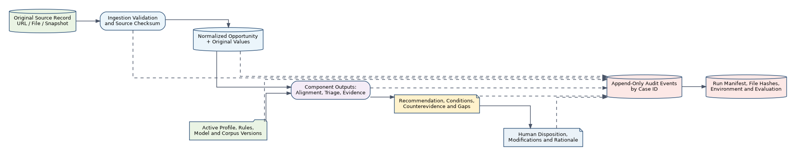

## 9. Major-Function UML-Style Use Case Diagrams

The use case diagrams use a UML 2.x structure: actors are outside the system boundary, use cases are represented as ellipses, and `«include»` and `«extend»` relationships identify required and conditional behavior.

### 9.1 Opportunity Intake and Provenance

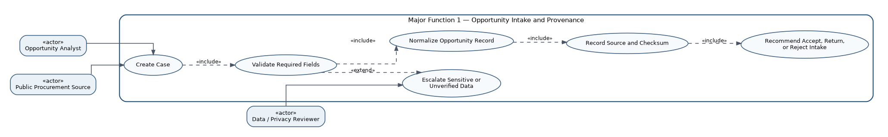

### 9.2 Organization Alignment and Historical Context

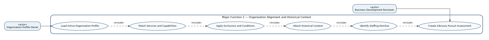

### 9.3 Clause-Theme Triage

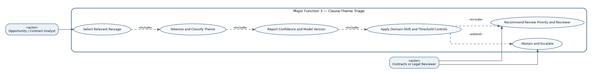

### 9.4 Evidence-Grounded Review and Escalation

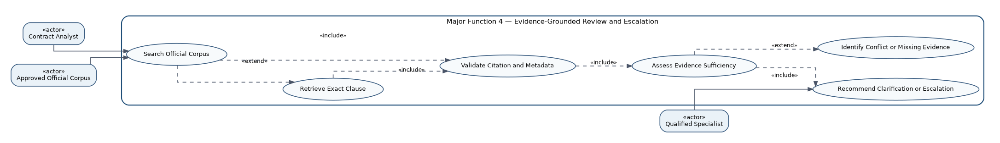

### 9.5 Packet Assembly and Recommendation

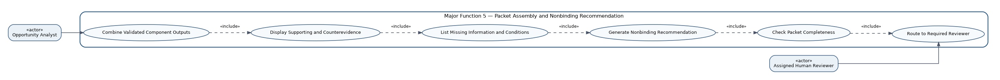

### 9.6 Human Review and Final Disposition

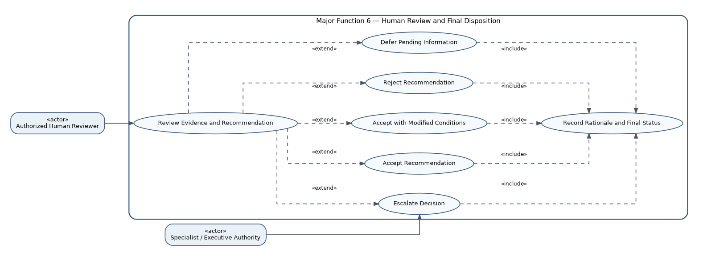

## 10. P2-01 Acceptance Check

| Acceptance Requirement | Architecture Response |
|---|---|
| Components and data stores are defined | Sections 3, 6, and the integrated component diagram |
| Component interactions are explicit | Section 4 and the architecture diagrams |
| Human checkpoints are visible | Sections 3.6 and 4, recommendation flow, use case 6 |
| Failure paths are explicit | Section 5 and the failure/escalation diagram |
| Configurability is built into the design | Sections 3.2 and 7, configuration diagram |
| Prior-project integration is intentional | Section 1 and layers 3.3–3.4 |
| Auditability and provenance are cross-cutting | Section 3.7 and provenance diagram |
| Responsible-AI boundaries are enforced | Sections 2, 5, and ADRs 3, 5, 7, and 9 |
| Project 6 FAR source warning is handled honestly | Sections 3.4 and ADR-10 |
| Use cases exist for every major function | Section 9 and six diagram artifacts |
